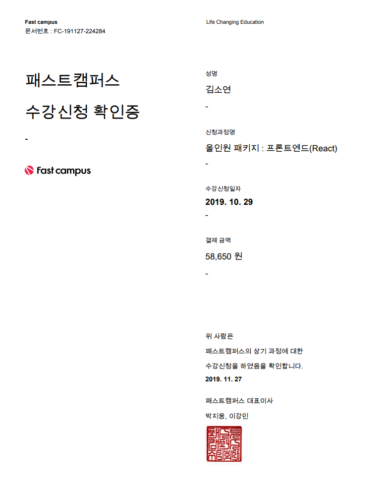
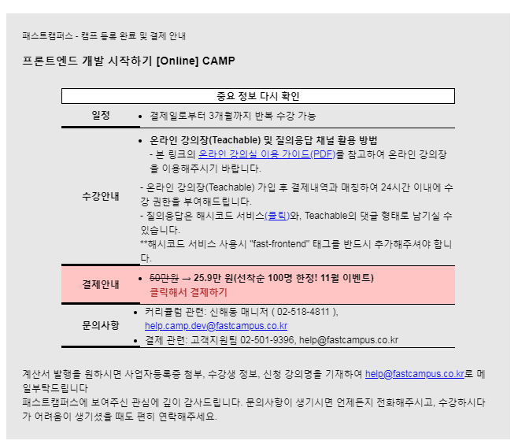

# [온라인강의] 패트스캠퍼스 올인원 패키지 : 프론트엔드 (React)
### 수강확인증
 

### 수강자료(강사님 수강자료를 참고하여 수업에 임하였습니다)
html/css/scss 공부
- https://heropy.blog/

 

scss의 경우 오픈 사이트에서 예제 공부를 하였습니다.
- https://www.sassmeister.com/

 

es6 공부
- https://learnjs.vlpt.us/

 

react 공부 중 (현재 교육 진행 중입니다.)
- https://react.vlpt.us/

샌드박스의 vanilla 로 예제 공부를 하였습니다.

- https://codesandbox.io/s/vanilla

# [온라인강의] 패스트캠퍼스 프론트엔드 개발 시작하기
** 해당 온라인 교육의 경우 수강확인증이 없어, 결제 영수증으로 증빙드립니다.

### 결제 증빙 자료
 
 
 
 
 

### codepen 수강 학습 자료
https://codepen.io/sy9104/pen/bQozXv 
https://codepen.io/sy9104/pen/bQKVYE 
https://codepen.io/sy9104/pen/OawNgZ 
https://codepen.io/sy9104/pen/aQadbY 
https://codepen.io/sy9104/pen/yQGMmg 
https://codepen.io/sy9104/pen/xQMVpJ 
https://codepen.io/sy9104/pen/QJYKew 
https://codepen.io/sy9104/pen/yQdLoV 
https://codepen.io/sy9104/pen/LXwZMr 
https://codepen.io/sy9104/pen/XoWjMR 
https://codepen.io/sy9104/pen/aPbmJL 
https://codepen.io/sy9104/pen/OrZJYo 

